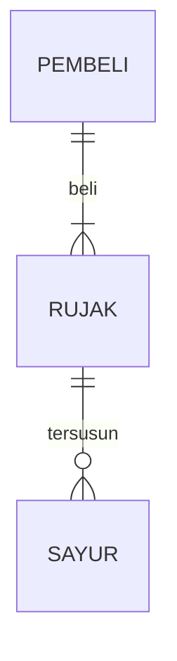

## 1.1 Latar Belakang

Manusia sering malakukan kejahatan di muka bumi ini. Kejahatan yang diperbuat oleh manusia sangat merugikan bagi manusia lainnya ataupun bagi lingkungan, seperti korupsi, anarkis, narkoba, judi, pembunuhan, dan banyak lagi. 
Di agama yang saya anut, di dunia ini terdapat sosok pembisik kejahatan, yaitu iblis. Iblis tidak nampak oleh manusia tetapi bisikan iblis bisa dirasakan oleh manusia. Iblis membisik kepada manusia untu berbuat kejahatan.
Oleh sebab itu, saya ingin membuat game tentang seorang manusia bernama Qatil. Qatil adalah seorang ahli suci dari sebuah negara. Ia akan bertarung di pulau iblis untuk menghentikan iblis untuk membisikkan kejahatan kepada manusia.
Wilayah pulau iblis akan dibagi menjadi beberapa wilayah. Setiap wilayah memiliki kejahatan khususnya masing-masing. Qatil akan melawan setiap wilayah itu dan mengalahkan raja iblis.

## 1.2. Deksripsi Teknologi Informasi

bla bla bla

## 1.3. Branding

bla bla bla

## 2. User Story

bla | bla | bla | bla
---|---|---|---
bla | bla | bla | ⭐⭐⭐⭐⭐

## 3. Struktur Data

Cara membuat aneka macam bentuk grafik menggunakan mermaid.js bisa lihat di [https://mermaid.js.org/syntax/entityRelationshipDiagram.html](https://mermaid.js.org/syntax/entityRelationshipDiagram.html) 

## 4. Arsitektur Sistem

Masih pake mermaid.js juga bisa lihat flowchart di [https://mermaid.js.org/syntax/flowchart.html](https://mermaid.js.org/syntax/flowchart.html)

## 5. Teknologi, Library, dan Framework

bla bla bla

## 6. Desain User Experience dan User Interface

Bisa load image 

## 7. Demonstrasi Video

Link youtube nya

## 8. Bagaimana mesin komputasi dan sistem operasi berperan dalam produk teknologi informasimu ?

Link youtube nya di detik jawaban ini

## 9. Bagaimana algoritma, struktur data, dan bahasa pemrograman berperan dalam produk teknologi informasimu ?

Link youtube nya di detik jawaban ini

## 10. Bagaimana metode pengembangan perangkat lunak / Software Development Life Cycle berperan dalam produk teknologi informasimu ?

Link youtube nya di detik jawaban ini

## 11. Bagaimana database / sistem basis data berperan dalam produk teknologi informasimu ?

Link youtube nya di detik jawaban ini
